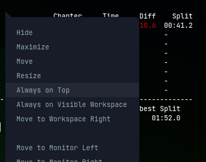

# cas - farewell

Celeste Auto-Splitter for Linux.

## Installing

```
git clone https://github.com/DevilFreak/cas-farewell.git
cd cas-farewell/
go build
```

## running cas - farewell

You can just execute the compiled binary and it will start with the default configurations.

Here are all the things you can configure without changing the code.

| Argument | Usage                                 | example |
| -------- | ------------------------------------- | ------- |
| run      | start the application (same as executing with nothing)| ./casf run       |
| help     | shows the help                                      | ./casf help       |
| show     | shows you personal best or best splits              | ./casf show best / ./cas show splits    |
| -i       | gives you more information                          | ./casf -i show best    |
| -s       | gives you more information about your splits        | ./casf -si run    |
| -save, -savefile| changes the savefile slot [0, 1, 2]       | ./casf -save 0    |

### Overlay

To run cas - farewell as an overlay you can simply use a terminal with 100% transparent background and mark as always on top. Then just resize it and move it to where you want your overlay to be.

I have done it via a bash:
```
xfce4-terminal --geometry=50x13+0+130 --hide-borders --working-directory="$HOME/git/cas-farewell/" -e "./casf -is" -H
```

and then mark as always on top (ALT + Spacebar to open menu):


## Route configuration

Modify `anyPercent` variable in `types.go`.

## Showcase

### Split


### New Run


#### Credits

This Repository was built on top of the original cas from ~bfiedler.
The original Repo can be found at https://sr.ht/~bfiedler/cas/
